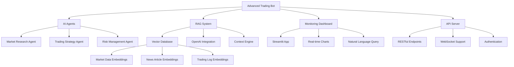

# 🤖 Advanced BSC Trading Bot

An intelligent, AI-powered trading bot for Binance Smart Chain (BSC) with advanced monitoring capabilities, multi-agent architecture, and RAG (Retrieval Augmented Generation) system.

## 🌟 Features

### 🧠 AI-Powered Trading
- **Multi-Agent System**: Specialized AI agents for market research, strategy analysis, and execution
- **RAG System**: Intelligent data retrieval and analysis using vector databases
- **Sentiment Analysis**: Real-time market sentiment monitoring from news and social media
- **Technical Analysis**: Advanced technical indicators and market structure analysis
- **Dynamic Strategy Selection**: AI chooses optimal trading strategies based on market conditions

### 📊 Advanced Monitoring
- **Streamlit Dashboard**: Beautiful, interactive web interface for real-time monitoring
- **Natural Language Querying**: Ask questions about your bot's performance in plain English
- **Real-time Analytics**: Live charts, performance metrics, and trading statistics
- **Alert System**: Smart notifications for important events and anomalies
- **Historical Analysis**: Comprehensive backtesting and performance tracking

### 🔧 Technical Excellence
- **RESTful API**: Complete API for integration with external tools
- **Vector Database**: Milvus integration for intelligent data storage and retrieval
- **Structured Logging**: Comprehensive logging with Winston and database storage
- **Rate Limiting**: Built-in API protection and resource management
- **Graceful Shutdown**: Proper cleanup and error handling

## 🏗️ Architecture



## 🚀 Quick Start

### Prerequisites
- Node.js 18+ 
- Python 3.8+
- BSC wallet with USDT and BNB
- OpenAI API key (optional but recommended)

### Installation

1. **Clone and Setup**
   ```bash
   git clone <repository-url>
   cd bsc-ranging-bot
   ./setup.sh
   ```

2. **Configure Environment**
   ```bash
   cp env.example .env
   # Edit .env with your configuration
   ```

3. **Start the Bot**
   ```bash
   npm start
   ```

4. **Start Monitoring Dashboard**
   ```bash
   npm run monitor
   # Open http://localhost:8501
   ```

## ⚙️ Configuration

### Environment Variables

```env
# BSC Network
BSC_RPC_URL=https://bsc-dataseed1.binance.org/
BSC_CHAIN_ID=56

# Wallet (REQUIRED)
WALLET_ADDRESS=0xYourWalletAddress
PRIVATE_KEY=your_private_key_here

# Trading Parameters
INITIAL_BUDGET=100
MIN_TRADE_AMOUNT=1
MAX_TRADE_AMOUNT=10
LOWER_BOUND_PERCENT=0.95
UPPER_BOUND_PERCENT=1.05

# AI Features (OPTIONAL)
OPENAI_API_KEY=sk-your-openai-api-key
MILVUS_HOST=localhost:19530

# API
API_PORT=3001
```

### Trading Strategies

The bot supports multiple AI-powered strategies:

1. **Ranging Strategy**: Buy low, sell high within defined bounds
2. **Momentum Strategy**: Follow market momentum with volume confirmation
3. **Mean Reversion**: Exploit price reversions from extremes
4. **Arbitrage Strategy**: Cross-DEX arbitrage opportunities

## 📊 Monitoring Dashboard

### Features
- **Real-time Portfolio Tracking**: Live P&L, balances, and performance
- **AI Chat Interface**: Ask questions about your bot's performance
- **Market Analysis**: Technical indicators, sentiment, and news
- **Trading History**: Detailed logs of all trades and decisions
- **System Health**: Agent status, database health, and alerts

### Access
- URL: `http://localhost:8501`
- Natural language queries: "Show me my profit today"
- Quick actions: Market analysis, performance review, strategy optimization

## 🔌 API Endpoints

### Health & Status
- `GET /api/health` - System health check
- `GET /api/status` - Bot status and performance
- `POST /api/control/start` - Start the bot
- `POST /api/control/stop` - Stop the bot
- `POST /api/control/emergency-stop` - Emergency stop

### Data Access
- `GET /api/trades` - Trading history
- `GET /api/logs` - System logs
- `GET /api/agents/activity` - Agent activity logs
- `GET /api/market/analysis` - Market analysis

### AI Features
- `POST /api/rag/query` - Natural language queries
- `GET /api/sentiment` - Market sentiment analysis
- `GET /api/strategies` - Available strategies

## 🤖 AI Agents

### Market Research Agent
- **Purpose**: Gathers market intelligence from multiple sources
- **Features**: News scraping, sentiment analysis, fundamental analysis
- **Data Sources**: CoinDesk, CoinTelegraph, DeFiPulse, social media

### Trading Strategy Agent
- **Purpose**: Makes intelligent trading decisions
- **Features**: Technical analysis, strategy selection, risk assessment
- **Capabilities**: Dynamic parameter adjustment, multi-strategy support

### Risk Management Agent
- **Purpose**: Monitors and manages trading risks
- **Features**: Position sizing, stop-loss, exposure limits
- **Protection**: Emergency stops, anomaly detection

## 🧠 RAG System

### Vector Database Integration
- **Storage**: Market data, news articles, trading logs as embeddings
- **Retrieval**: Semantic search for relevant context
- **Analysis**: AI-powered insights from historical data

### Context Engineering
- **Parallel Processing**: Multiple data sources analyzed simultaneously
- **Relevance Scoring**: Intelligent filtering of irrelevant information
- **Continuous Learning**: System improves with more data

## 📈 Performance Analytics

### Metrics Tracked
- **Financial**: P&L, ROI, Sharpe ratio, max drawdown
- **Operational**: Success rate, trade frequency, execution time
- **AI Performance**: Agent accuracy, decision confidence, learning progress

### Reporting
- **Real-time**: Live dashboard updates
- **Historical**: Comprehensive backtesting and analysis
- **Export**: CSV/JSON data export for external analysis

## 🛡️ Security Features

### Wallet Security
- **Private Key Protection**: Encrypted storage and secure handling
- **Transaction Validation**: Multiple checks before execution
- **Slippage Protection**: Configurable slippage limits

### System Security
- **Rate Limiting**: API protection against abuse
- **Input Validation**: Sanitized inputs and outputs
- **Error Handling**: Graceful degradation and recovery

## 🔧 Development

### Project Structure
```
bsc-ranging-bot/
├── agents/                 # AI agents
├── database/              # Database models and setup
├── monitoring/            # Streamlit dashboard
├── rag/                   # RAG system components
├── logs/                  # Log files
├── data/                  # Database files
├── AdvancedTradingBot.js  # Main bot application
├── package.json           # Node.js dependencies
└── setup.sh              # Installation script
```

### Adding New Agents
1. Extend `BaseAgent` class
2. Implement `performAction` method
3. Register in main bot class
4. Add monitoring in dashboard

### Custom Strategies
1. Add strategy logic to `TradingStrategyAgent`
2. Implement technical indicators
3. Configure strategy parameters
4. Test with backtesting

## 📚 Advanced Usage

### Custom Indicators
```javascript
// Add custom technical indicators
const customIndicator = {
  name: 'MyIndicator',
  calculate: (prices, period) => {
    // Your calculation logic
    return result;
  }
};
```

### Webhook Integration
```javascript
// Custom webhook handlers
bot.on('trade_executed', (tradeData) => {
  // Send to external system
  sendToWebhook(tradeData);
});
```

### Machine Learning Integration
```javascript
// Custom ML models
const mlPredictor = new MLPredictor();
const prediction = await mlPredictor.predict(marketData);
```

## 🚨 Troubleshooting

### Common Issues

1. **Bot won't start**
   - Check wallet configuration in `.env`
   - Verify BSC RPC connection
   - Ensure sufficient balance

2. **API not responding**
   - Check if port 3001 is available
   - Verify API server started correctly
   - Check firewall settings

3. **Dashboard not loading**
   - Ensure Python dependencies installed
   - Check Streamlit installation
   - Verify port 8501 is available

4. **Vector database errors**
   - Bot works in mock mode without Milvus
   - Check Milvus connection settings
   - Verify Docker installation for Milvus

### Logs and Debugging
```bash
# View real-time logs
tail -f logs/combined.log

# Check specific log levels
grep "ERROR" logs/error.log

# Monitor agent activity
tail -f logs/agent_activity.log
```

## 📋 Roadmap

### Upcoming Features
- [ ] Multi-DEX support (Uniswap, SushiSwap)
- [ ] Advanced ML models for price prediction
- [ ] Telegram/Discord bot integration
- [ ] Mobile app for monitoring
- [ ] Advanced risk management tools
- [ ] Social trading features
- [ ] Backtesting framework
- [ ] Strategy marketplace

### Performance Improvements
- [ ] Microservices architecture
- [ ] Kubernetes deployment
- [ ] Redis caching layer
- [ ] GraphQL API
- [ ] Real-time WebSocket updates

## 🤝 Contributing

1. Fork the repository
2. Create feature branch (`git checkout -b feature/amazing-feature`)
3. Commit changes (`git commit -m 'Add amazing feature'`)
4. Push to branch (`git push origin feature/amazing-feature`)
5. Open Pull Request

## 📄 License

This project is licensed under the MIT License - see the [LICENSE](LICENSE) file for details.

## ⚠️ Disclaimer

**This software is for educational and research purposes only. Trading cryptocurrencies involves substantial risk of loss and is not suitable for all investors. The high degree of leverage can work against you as well as for you. Before deciding to trade cryptocurrency, you should carefully consider your investment objectives, level of experience, and risk appetite. The possibility exists that you could sustain a loss of some or all of your initial investment and therefore you should not invest money that you cannot afford to lose.**

## 🙏 Acknowledgments

- Built with advanced AI workflows inspired by modern MCP and agent architectures
- Integrates best practices from RAG systems and context engineering
- Utilizes state-of-the-art vector database technology
- Inspired by the latest developments in AI-powered trading systems

## 📞 Support

- 📧 Email: support@your-domain.com
- 💬 Discord: [Join our community](https://discord.gg/your-server)
- 📖 Documentation: [Full docs](https://docs.your-domain.com)
- 🐛 Issues: [GitHub Issues](https://github.com/your-repo/issues)

---

**Happy Trading! 🚀**

*Remember: Always start with small amounts and never invest more than you can afford to lose.*